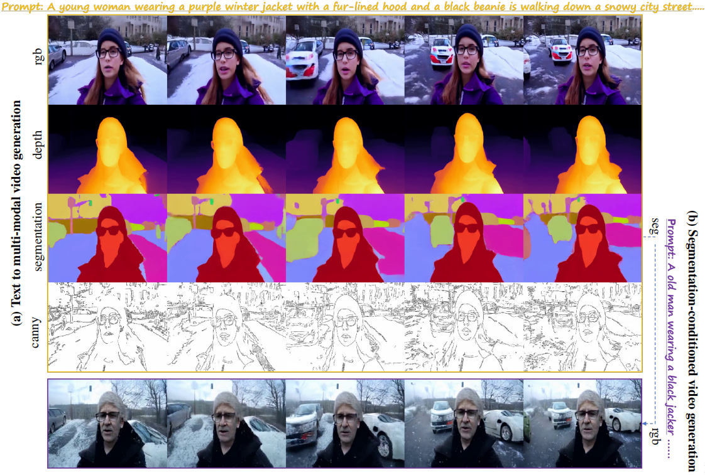

# OmniVDiff: Omni Controllable Video Diffusion for Generation and Understanding

In this paper, we propose a novel framework for controllable video diffusion, OmniVDiff, aiming to synthesize and comprehend multiple video visual content in a single diffusion model.



Given a video with four paired modalities, (a) we first encode it into latents using a shared 3D-VAE encoder; (b) then, concatenate them along the channel dimension and apply noise for video diffusion, where the denoised latents are then decoded into their respective modalities via modality-specific decoding heads; (c) Finally, each modality can be reconstructed into color space by the 3D-VAE decoder . During inference, the model enables various tasks by dynamically adjusting the role of each modality: (d) text-to-video generation, where all modalities are denoised from pure noise and (e) X-conditioned generation, where the condition X is given and other modalities are denoised from pure noise. If X is RGB modality, the model will perform generative understanding.


## [Project page]() |  [Paper]()

Code is coming soon.


## Citation

Cite as below if you find this repository is helpful to your project:

```
@article{xdb2025OmniVDiff,
  author    = {Xi, Dianbing and Wang, Jiepeng and Liang, Yuanzhi and Qi, Xi and Huo, Yuchi and Wang, Rui and Zhang, Chi and Li, Xuelong},
  title     = {OmniVDiff: Omni Controllable Video Diffusion for Generation and Understanding},
  journal   = {arXiv preprint arXiv:2504.xxxx},
  year      = {2025},
}
```